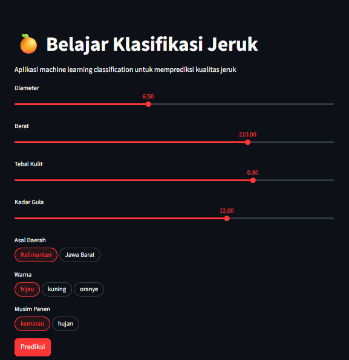

# 🍊 Belajar Klasifikasi Jeruk


> Aplikasi web Machine Learning interaktif untuk memprediksi **kualitas jeruk** berdasarkan atribut fisik dan asal daerah, dibangun dengan Python dan Streamlit.

🔗 **Live Demo:** [belajar-klasifikasi-jeruk-rizal.streamlit.app](https://belajar-klasifikasi-jeruk-rizal.streamlit.app/)

---

## 📌 Tentang Proyek

Proyek ini mengimplementasikan model Machine Learning klasifikasi untuk memprediksi kualitas jeruk berdasarkan fitur-fitur seperti diameter, berat, tebal kulit, kadar gula, asal daerah, warna, dan musim panen. Model dilatih menggunakan dataset jeruk dan di-deploy sebagai aplikasi web interaktif melalui Streamlit.

---

## ✨ Fitur Aplikasi

- 🎚️ **Input Slider** — Pengguna memasukkan nilai Diameter, Berat, Tebal Kulit, dan Kadar Gula secara interaktif
- 🏷️ **Pilihan Kategori** — Memilih Asal Daerah (Kalimantan / Jawa Barat), Warna (hijau / kuning / oranye), dan Musim Panen (kemarau / hujan)
- ⚡ **Prediksi Real-time** — Hasil klasifikasi kualitas jeruk ditampilkan setelah klik tombol **Prediksi**
- 🌙 **Dark Mode UI** — Antarmuka gelap yang bersih dan nyaman digunakan

---

## 🛠️ Teknologi yang Digunakan

| Teknologi | Kegunaan |
|-----------|----------|
| Python | Bahasa pemrograman utama |
| Streamlit | Framework web app interaktif |
| scikit-learn | Training & inferensi model ML |
| Joblib | Menyimpan & memuat model (`.joblib`) |
| Pandas | Manipulasi dan analisis data |
| NumPy | Komputasi numerik |
| Jupyter Notebook | Eksplorasi data & eksperimen model |

---

## 🤖 Model Machine Learning

- **Algoritma:** `Logistic Regression`
- **Dataset:** `Dataset Kualitas Jeruk buatan sendiri]`
- **Fitur Input:** Diameter, Berat, Tebal Kulit, Kadar Gula, Asal Daerah, Warna, Musim Panen
- **Target/Label:** Kualitas Jeruk `Baik / Sedang / Jelek`

---

## 📁 Struktur Proyek

```
belajar-klasifikasi-jeruk/
│
├── app_streamlit.py                    # Aplikasi Streamlit (main)
├── belajar_klasifikasi_jeruk.ipynb     # Jupyter Notebook: EDA & training model
├── jeruk_balance_500.csv               # Dataset jeruk (raw)
├── model_klasifikasi_jeruk.joblib      # Model ML yang sudah dilatih & disimpan
└── README.md
```

---

## 📸 Screenshot



> Atau lihat langsung: [belajar-klasifikasi-jeruk-rizal.streamlit.app](https://belajar-klasifikasi-jeruk-rizal.streamlit.app/)

---

## 📖 Cara Penggunaan

1. Buka aplikasi melalui live demo atau jalankan secara lokal
2. Atur nilai **Diameter**, **Berat**, **Tebal Kulit**, dan **Kadar Gula** menggunakan slider
3. Pilih **Asal Daerah**, **Warna**, dan **Musim Panen** sesuai jeruk yang ingin diprediksi
4. Klik tombol **🔴 Prediksi** untuk melihat hasil klasifikasi kualitas jeruk

---

## 👤 Author

**Rizal**

- 🔗 GitHub: [@rizaladitiyosup](https://github.com/rizaladitiyosup)
- 🌐 Live App: [belajar-klasifikasi-jeruk-rizal.streamlit.app](https://belajar-klasifikasi-jeruk-rizal.streamlit.app/)

---

## 📄 Lisensi

Proyek ini dibuat untuk keperluan pembelajaran dan portofolio pribadi.  
Bebas dijadikan referensi dengan mencantumkan kredit yang sesuai.

---

<p align="center">Dibuat dengan ❤️ menggunakan Python & Streamlit 🐍</p>
